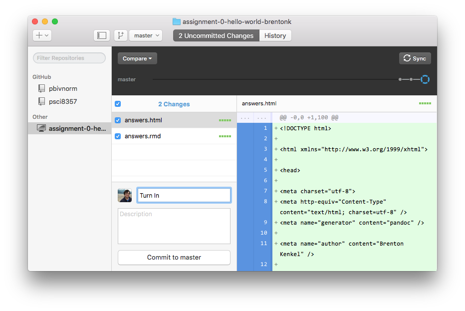

I will distribute and manage homework assignments through [GitHub Classroom](http://classroom.github.com).  I will send out a link for each assignment.  When you follow the link, it will automatically create a private GitHub repository for you that contains the instructions for the assignment, along with any necessary data or starter code.

Once the repository has been made, you should "clone" it to a directory on your own computer via the GitHub Desktop app.  All your work should take place in this directory.  When you're using R, your working directory should be this directory.  Your code should always contain relative, not absolute path names and file names, as illustrated below.

```r
my_data <- read.csv("data.csv")  # Good
    
my_data <- read.csv("/Users/Brenton/Courses/Stat2/Homework1/data.csv")  # Bad
```

{width=100%}

Once you are finished with your writeup, you should compile it as an HTML file in R Markdown.  You should then make a commit containing your R Markdown source file and the HTML output, with the title of the commit being "Turn In".  Finally, to upload it to Matt and me, use the "Sync" button in GitHub Desktop to push your commits to GitHub.
